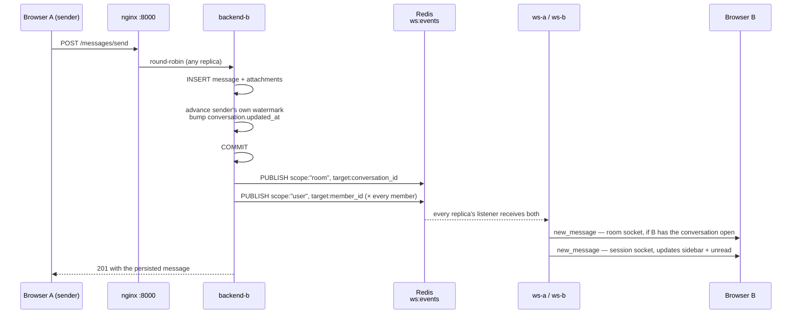
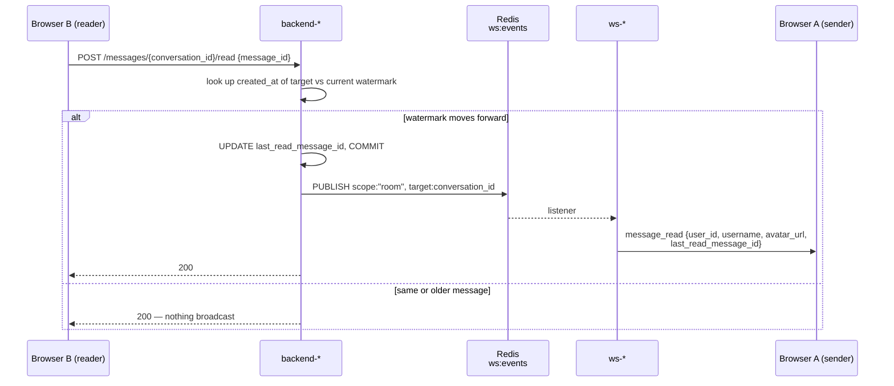
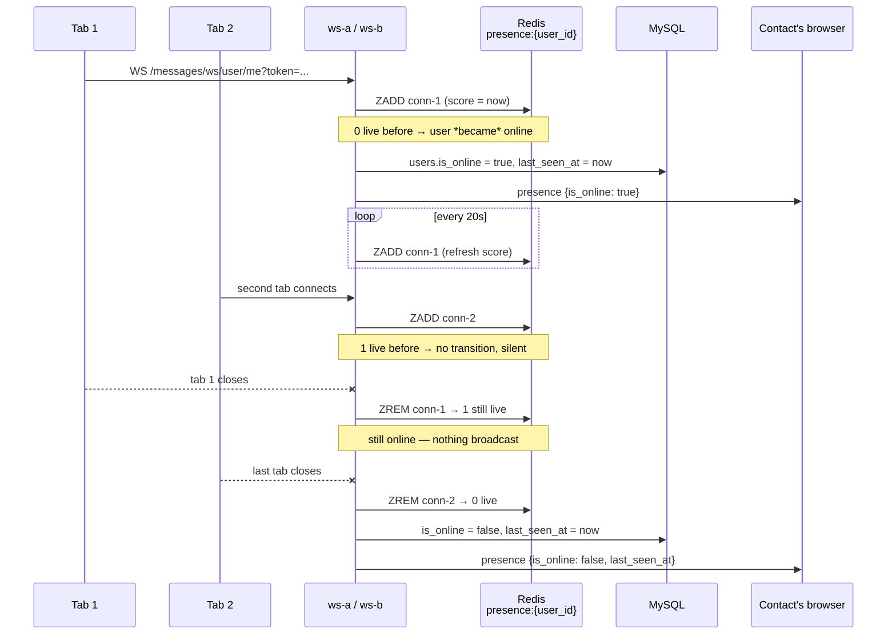

# Chat Realtime Demo


A full-stack realtime chat application — FastAPI + React + WebSockets over Redis Pub/Sub, split into two independently deployable backend services, horizontally scaled behind nginx, with three independent versioned environments (dev/staging/prod) and Sentry error tracking baked in.

Built as a hands-on demo of a realistic, horizontally-scalable chat backend: direct messages, group conversations, live delivery across replicas, typing indicators, read receipts and online presence — not a toy single-process WebSocket echo server.

## Features

- JWT auth (register/login), user search
- Direct messages and group conversations, with add-member support
- Realtime delivery over WebSockets — works even when two users' connections land on *different* replicas, or on a different service than the one that handled the send
- **Typing indicators** — live, with per-user avatars in groups
- **Read receipts ("seen")** — in a group, which members have seen each message
- **Online presence** — counted across tabs and replicas, so closing one of two tabs doesn't report you offline
- Unread counts, paginated message history
- Dark/light theme, message attachments (image/video/file/mixed)

## Architecture

Two backend services, deployed separately, meeting only at Redis and MySQL:

```
                      Browser
                    ╱         ╲
              HTTP ╱           ╲ WebSocket
                  ▼             ▼
        nginx :8000          nginx :8001
              │                   │
      ┌───────┼───────┐      ┌────┴────┐
      ▼       ▼       ▼      ▼         ▼
  backend-a  -b      -c    ws-a      ws-b
   (chat_with_fastapi)    (chat_with_fastapi_ws)
      │       │       │      │         │
      └───────┴───┬───┴──────┴─────────┘
                  ▼
            MySQL   Redis ◀── Pub/Sub backbone
```

**Why two services.** HTTP requests are short and CPU/DB-bound; WebSocket connections are long-lived and bound by memory and file descriptors. Splitting them lets each scale on its own limit, and keeps a problem in one from taking down the other: with the API stopped, open sockets stay open and realtime keeps flowing; with the WebSocket service stopped, `POST /messages/send` still returns 201 and persists.

**How they stay connected.** A message sent by a client whose socket is held by `ws-a` may be POSTed to `backend-b`, which has no sockets at all. Instead of writing to an in-memory registry, `backend-b` publishes a JSON envelope to a Redis channel; every `ws-*` replica subscribes and delivers to whichever of its own sockets match. That's what makes load-balanced WebSocket traffic actually work instead of silently dropping messages between users on different replicas.

The two services never call each other. They agree on four things only — the Redis envelope format, `SECRET_KEY`/`ALGORITHM` for JWT verification, the Redis presence key layout, and the database schema. [`CLAUDE.md`](CLAUDE.md) documents that contract; it is the first place to look when sockets fail while everything else works.

## Realtime flows

The three realtime features all ride the same Redis channel, but each answers a different question. Sequence diagrams below; the contract they share is in [`CLAUDE.md`](CLAUDE.md).

### Sending a message

The point of the split: the replica that *handles* the send is almost never the one *holding* the recipient's socket. Nothing is written to an in-process registry — the API publishes, and every WebSocket replica delivers to whatever sockets it happens to own.



**Why publish twice.** The room broadcast reaches people looking at that conversation right now. The per-member publish reaches everyone else — someone reading a different chat still needs their sidebar and unread badge to move. A client with both sockets open receives both copies and deduplicates by message id.

**Delivery is best-effort by design.** The publish happens *after* `COMMIT`, so a Redis outage logs a warning and the request still returns 201. The message is in MySQL; the recipient sees it on their next fetch instead of instantly. The reverse order — publish, then commit — could announce a message that never persisted.

### Read receipts ("seen")

Stored as a **watermark per member**, not a row per (message, reader): `conversation_members.last_read_message_id` means "read up to here". That answers both *did they see it?* and, in a group, *who saw it?* in one row per member, instead of a table that grows with the message count. (This is why the `message_reads` table exists but stays unused.)



**The watermark never walks backwards.** A client scrolling up through history would otherwise "un-read" messages it had already seen, so the target's `created_at` is compared against the current one and an older id is ignored. Sending also counts as reading — `MessageService.send()` advances the sender's own watermark in the same transaction, so it never lags behind their own messages.

**Room-only, no per-member fan-out** — unlike `new_message`. A receipt only matters to someone currently looking at that conversation; anyone who opens it later refetches `GET /messages/{id}/reads` and gets the same answer. Fanning out would cost one publish per member for something nobody would see. The frontend then groups receipts by `last_read_message_id`, which is what renders each reader's avatar under the last message they read.

### Online presence and last seen

The **session socket is the signal** — one per tab, alive for the whole session, so "connected" means online and "disconnected" means offline without any extra client heartbeat protocol.

Presence has to be **counted, not flagged**. A user with two tabs open — possibly on two different `ws-*` replicas — must stay online when one closes. So `presence:{user_id}` is a Redis sorted set whose members are connection ids and whose scores are the last heartbeat; the user is online while any score is newer than `CONNECTION_TTL_SECONDS`.



**Only real transitions broadcast.** `connected()` / `disconnected()` return whether the user actually crossed the boundary, so the second tab opening and the first tab closing are both silent.

**Crashed replicas clean up after themselves.** Reads apply the TTL as a score cutoff, so a connection left behind by a replica that died without running its disconnect path simply stops counting once its heartbeat goes stale — no sweeper task, and no ghost "online" users. The heartbeat (`HEARTBEAT_INTERVAL_SECONDS`, 20s) sits comfortably under the TTL (`CONNECTION_TTL_SECONDS`, 60s), so one dropped refresh doesn't flap someone offline.

**Redis is the live truth; `users.is_online` is only the last known value**, written on transitions alongside `last_seen_at`. That's why `GET /conversations` and `GET /users/search` overlay `presence.online_among(...)` onto their responses rather than trusting the column — a replica killed with `SIGKILL` leaves the column stale, but the sorted set expires on its own.

**Transitions notify contacts only** — people who share a conversation with you (`ConversationService.get_contact_ids()`). Broadcasting to every account would leak who is online to strangers and cost one publish per user on the instance.

### Typing indicators

The only frames a client sends *up* a socket. `{"event": "typing", "data": {"is_typing": true}}` goes up the room socket and is rebroadcast to that room with the sender excluded. Anything else arriving on a socket — including non-JSON keepalives — is ignored rather than closing the connection.

A disconnect auto-broadcasts `is_typing: false`, because a client that closes mid-typing never gets to retract it; the frontend additionally expires a stale flag after `TYPING_TTL_MS` in case even that is lost.

## Tech stack

| | |
|---|---|
| **HTTP API** | FastAPI · SQLAlchemy 2.0 (async, `aiomysql`) · MySQL · Alembic · JWT (`python-jose`) · bcrypt · Redis (publish) · Sentry |
| **WebSocket service** | FastAPI · Redis (Pub/Sub) · async SQLAlchemy Core · JWT verification · Sentry |
| **Frontend** | React 19 · TypeScript · Vite · Tailwind CSS v4 · Zustand · Axios · React Router v7 · Sentry |
| **Load balancer** | nginx (Layer 7, round-robin + passive health checks) — one per service |
| **Testing** | pytest (both backends, mocked DB/Redis) · Vitest + Testing Library (frontend) · Playwright (e2e, drives the real stack) |
| **CI/CD** | GitHub Actions — test on every PR, build & publish versioned images to GHCR on merge to `main` |

## Quick start

Requires Docker.

```bash
git clone https://github.com/tranduc2612/chat_realtime_demo.git
cd chat_realtime_demo
make up             # whole dev environment: HTTP API + WebSocket service + frontend
```

- App: **http://localhost:5173**
- API docs (Swagger): **http://localhost:8000/api/v1/docs**
- WebSocket service health: **http://localhost:8001/health**

That brings up MySQL, Redis, runs migrations, starts three load-balanced API replicas, two WebSocket replicas, and the frontend dev server.

`make up` is a convenience for local work. Real deploys go one service at a time: `make dev` brings up the HTTP API side only and `make ws` the WebSocket side only, each without touching the other's containers. `make down` tears the whole environment down.

## Running without Docker

Three processes: the HTTP API, the WebSocket service, and the frontend.

**Prerequisites:** Python 3.12+, Node 22, a running MySQL server, and a running Redis server (`brew install mysql redis && brew services start mysql redis` on macOS — Redis is not optional; it is the only path between the two backends).

**1. HTTP API** (`chat_with_fastapi/`) — REST only, no sockets

```bash
cd chat_with_fastapi
python -m venv venv && source venv/bin/activate   # Windows: venv\Scripts\activate
pip install -r requirements.txt

cp .env.example .env
# edit .env: set DATABASE_URL/DATABASE_SYNC_URL to a MySQL user/db you have
# (create the database first, e.g. `mysql -u root -p -e "CREATE DATABASE chat_realtime_demo"`)

alembic upgrade head        # this project owns the schema; the WS one never migrates
make dev                    # == uvicorn app.main:app --reload  →  :8000
```

**2. WebSocket service** (`chat_with_fastapi_ws/`, separate terminal) — sockets only, no REST

```bash
cd chat_with_fastapi_ws
python -m venv venv && source venv/bin/activate
pip install -r requirements.txt

cp .env.example .env
# Point DATABASE_URL and REDIS_URL at the SAME MySQL and Redis as the API.
# Leave SECRET_KEY unset if the API's is unset, or set both to the same value —
# a mismatch rejects every socket with close code 4001 and looks like a bare
# handshake failure in the browser.

make dev                    # == uvicorn app.main:app --reload --port 8001
```

**3. Frontend** (`chat_frontend/`, separate terminal)

```bash
cd chat_frontend
npm install

cp .env.sample .env
# edit .env — note the two different ports:
#   VITE_API_URL=http://localhost:8000/api/v1
#   VITE_WS_URL=ws://localhost:8001/api/v1

npm run dev
```

Frontend is now at **http://localhost:5173**. Without step 2 the app still logs in and sends messages, but every realtime feature is gone — no typing, no seen, no presence, and new messages only appear after a reload.

## Environments

Dev, staging, and production are three independent, identically-shaped environments — one compose file each — on their own port ranges so **all three can run at once** on one machine. Each file holds two independently deployable sides:

| Env | HTTP API | WebSockets | App | Notes |
|---|---|---|---|---|
| dev | `make dev` → :8000 | `make ws` → :8001 | :5173 | hot reload, DB/Redis ports exposed |
| staging | `make staging` → :8080 | `make ws-staging` → :8081 | :5174 | real production build, needs `.env.staging` |
| prod | `make prod` → :9000 | `make ws-prod` → :9001 | :5175 | real production build, needs `.env.prod` |

Each side has a matching `-down` target (`make ws-staging-down`, etc.) that removes just that side's containers, leaving the other running. `make up` / `make staging-up` / `make prod-up` start a whole environment at once, and `make down` / `make staging-down-all` / `make prod-down-all` tear one down completely.

First-time staging/prod setup: `cp .env.staging.example .env.staging` (and same for prod), then fill in real secrets — the committed dev `.env` works as-is.

The app version is a single source of truth: the root `VERSION` file. It flows into every image tag and into `APP_VERSION` (visible live in Swagger and tagged on every Sentry event). Bump `VERSION`, rerun the `make` targets — that's the whole release process.

## Project structure

```
chat_realtime_demo/
├── chat_with_fastapi/      # HTTP API service — REST only, owns the schema
├── chat_with_fastapi_ws/   # WebSocket service — sockets only, no REST
├── chat_frontend/          # React frontend
├── e2e/                    # Playwright end-to-end tests, drives the real stack
├── nginx/
│   ├── nginx.conf          # HTTP API load balancer  (:8000)
│   └── nginx.ws.conf       # WebSocket load balancer (:8001)
├── .github/workflows/      # CI/CD (GitHub Actions)
├── VERSION                 # single source of truth for the app version
├── Makefile                # make dev / ws / staging / prod / up / down
├── docker-compose.yml          # dev        — API + WebSocket + frontend + infra
├── docker-compose.staging.yml  # staging    — same shape, own ports/volume
└── docker-compose.prod.yml     # production — same shape, own ports/volume
```

## Testing

```bash
# HTTP API unit tests (mocked DB, no MySQL/Redis needed)
cd chat_with_fastapi && make test

# WebSocket service unit tests (mocked Redis and DB session)
cd chat_with_fastapi_ws && make test

# Frontend unit tests
cd chat_frontend && npm run test

# End-to-end — spins up both services via docker compose and drives a real browser
cd e2e && npm run test
```

All four run automatically in CI on every pull request.

## Error tracking

Sentry is wired into both backends and the frontend, gated entirely on a `SENTRY_DSN`/`VITE_SENTRY_DSN` env var being set — unset (dev's default) means it's fully off, no code path taken, nothing reported. Staging and prod have it configured by default once you fill in `.env.staging`/`.env.prod`.

## More detail

- [`chat_with_fastapi/README.md`](chat_with_fastapi/README.md) — HTTP API setup, routes, data model
- [`chat_with_fastapi_ws/README.md`](chat_with_fastapi_ws/README.md) — WebSocket service setup, events, presence
- [`CLAUDE.md`](CLAUDE.md) — full developer/architecture reference, including the contract between the two services
